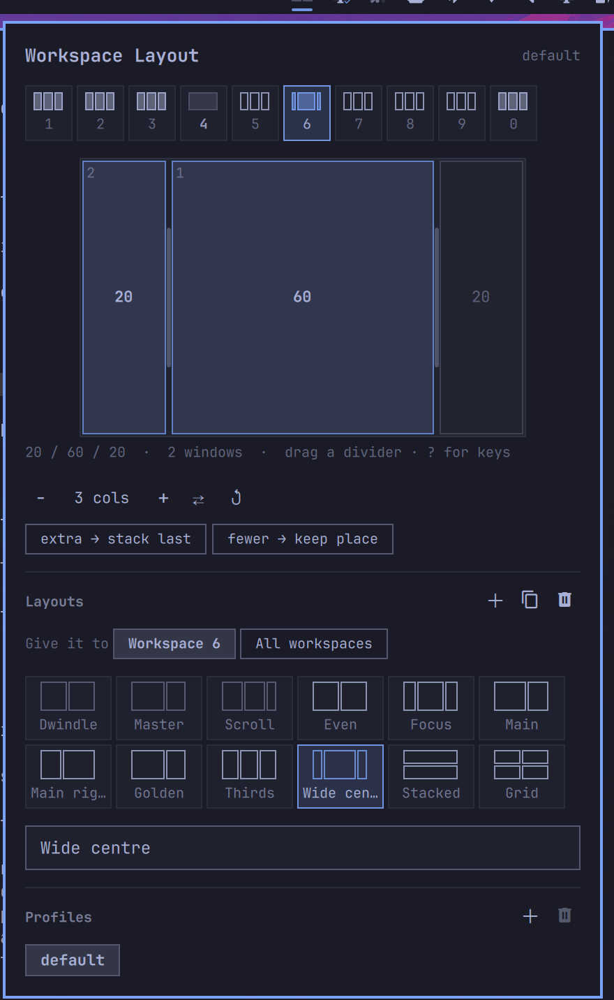

# Workspace Layout

An Omarchy plugin for deciding how a Hyprland workspace splits its screen.

Drag the dividers and your real windows move under the cursor. `25 / 50 / 25`,
a `60 / 40` main-and-side, thirds, a grid, or whatever you drag to. Name a shape
and reuse it. Give a shape to one workspace or to all of them. Pin the apps that
belong there so they open there. Save the whole arrangement as a profile and
switch the lot when the work changes.



## Why it is not just a script

Hyprland 0.55 gained Lua-defined tiling layouts. This plugin registers one per
layout you create and assigns them with workspace rules, so the split is a
property of the workspace rather than a resize you have to redo every time a
window opens. Close a window and the rest reflow into the shape. Open a fifth
one and it stacks where you said extras should go.

## Requirements

| Needs | Why |
| --- | --- |
| Omarchy (Quattro plugin runtime) | the bar widget and panel are Quickshell QML loaded by `omarchy-shell` |
| Hyprland 0.55 or newer | `hl.layout.register`, the Lua layout API the whole plugin is built on |
| `hyprctl` | on `PATH`; how layouts and workspace rules are applied |

No other runtime, package, background service, network access, or privileged
command. Everything ships in this repository: the panel is QML, the layout
engine is Lua generated from `Model.js`, and there is no compiled component.

Built and tested against Hyprland 0.56.2 on Omarchy 4.0.2.

## Install

```bash
omarchy plugin add https://github.com/bjarneo/omarchy-workspace-layout --enable
```

Or, from a clone:

```bash
cp -r omarchy-workspace-layout ~/.config/omarchy/plugins/bjarneo.workspace-layout
omarchy plugin enable bjarneo.workspace-layout right
omarchy restart shell
```

On first run the plugin appends one guarded line to `~/.config/hypr/hyprland.lua`
that loads its generated layouts. Nothing is assigned to any workspace until you
pick something, so installing it changes nothing about how your desktop tiles.

## Using it

Click the bar icon — it is a live miniature of the current workspace's layout.
The panel scrolls when it outgrows the screen, and `Esc` closes it — everything
else in it is pointed at rather than typed.

**Workspace strip.** Every workspace with the shape it is running. Click one and
you go there: the windows move under the cursor as you drag, which is worth
something only if you are looking at them. Right-click one for what to do with
the workspace itself — hand it back to Hyprland, capture the windows on it, or
release the apps pinned to it.

**Canvas.** The layout at your monitor's real proportions. Slots holding a window
are filled and numbered; empty slots are outlined. Drag a divider and the windows
move as you drag — nothing is written to disk until you let go. Dividers snap to
halves, thirds, quarters, fifths and the golden ratio; hold `Shift` to drag free.
Double-click a divider to even everything out. A slot that has been split has a
divider inside it too, running the other way; drag that to make the halves
uneven.

**Shape row.** Add or remove a slot, flip between columns and rows, split evenly,
and choose where windows past the last slot go. The count reads `3 cols · 4
places` when one of those columns is split.

| Setting | With 5 windows in a 3-slot layout |
| --- | --- |
| `extra → stack last` | slots 1 and 2 take one window, slot 3 stacks three |
| `extra → stack first` | slot 1 stacks three, slots 2 and 3 take one each |
| `extra → new slots` | five slots, the new ones as wide as the last |

**With fewer windows than slots**, `fewer → rescale` grows the surviving slots
to fill the screen, and `fewer → keep place` leaves every slot exactly where it
would be when full. `Focus` and `Wide centre` ship on *keep place*, which is what
makes them useful: one window sits in the middle 50% with margins either side
and stays there as the second and third arrive, instead of blowing up to
fullscreen and then sliding off-centre. Layouts without a main area — `Even`,
`Thirds`, `Main` — rescale, so a lone window fills the screen.

**Which slot fills first, and what the numbers mean.** The widest one. In a `25/50/25` the first window on
the workspace takes the centre and later windows go out to the sides; in a
`60/40` it takes the 60. Slots of equal width fill left to right, so an even
split or thirds behaves exactly as it reads. The slot numbers in the canvas show
the order, which is worth knowing when you pin apps to them: drag a divider far
enough that another slot becomes the widest and the numbering follows, so the
apps pinned to those numbers swap places with it. To fill strictly left to right
instead — and keep the numbering still — set `"fill": "order"` on the layout in
the JSON.

**Apps.** Pin an app to the selected workspace and it opens there from then on,
whichever workspace you are on when you launch it. Search by the name you know
it by: the field reads every app installed on the machine as well as everything
with a window open, and whatever you type is offered as a pin of its own, so an
app the machine has no entry for still gets one. Windows it already has come
along at the moment
you pin it; after that they are yours to move wherever you like. An app can only
be pinned in one place, so pinning it under another workspace moves the pin
rather than adding a second.

A place can hold several apps and an app several places: aim a slot and click
each app you want there, and whichever is open takes it. If you want both on
screen at once, split the place in two instead.

**Rearrange by dragging.** Hold a tile and drop it on another and the two
exchange their apps. The tile you picked up fades, the one under the cursor
lights up, and what you are carrying rides with the pointer — `Neovim ⇄ 3`, the
app in your hand and the place it is about to take. The windows follow on the
next re-tile. A short wobble is still a click, so aiming a slot and carrying one
stay different gestures.

**Give an app a place in the split.** Click a slot in the canvas and it lights
up; the next app you pick goes there and its name is written into that slot, so
the canvas answers both "how wide" and "what lives here". Click the slot again
to stop aiming.

An app is not one window, so it can hold several slots: aim at another one and
click the app again to give it both. Two terminals then take the left and right
thirds while everything else fills the middle, and it does not matter which one
you opened first. Clicking an app on a slot it already holds takes that one
back. A third window of the same app has no place left on the list and fills
whatever is free, and a slot that does not exist yet — because fewer windows are
open than the layout has slots — is skipped rather than held empty.

**Start the workspace.** One button under the list opens everything pinned here
that has no window yet — press it after a reboot and the workspace furnishes
itself, each app landing in the slot you gave it. Apps already running are left
alone, and so is anything the machine has no launcher for.

**Cut a place in two** without leaving the canvas: hover a tile and two arrows
appear in its corner — `↔` puts another slot beside it, `↕` cuts it into a top
and a bottom. In a rows layout the arrows swap, because they are named for what
you will see rather than for the layout's grain. The new place is aimed at
straight away, so the app that belongs there is the next thing you click.

**Right-click a slot** for the rest of what can be done to a place:

| Option | Does |
| --- | --- |
| `Split side by side` | the slot becomes two, left and right |
| `Split top and bottom` | the slot keeps its width and holds two windows, one above the other |
| `Merge back into one` | undoes a split |
| `Remove this slot` | its space goes to the neighbour |
| `Even out the split` | equal shares across the layout |
| `Clear the apps here` | releases the apps you gave this place |

Both splits take the room from that slot alone, so the rest of the shape stays
where it is, and asking for the same split twice gives three parts. The two
options are named by what you will see: in a rows layout they swap which axis
they cut.

A layout with a split slot always keeps its places — `fewer → rescale` has no
answer to "which half should grow?", so the choice goes away while a slot is
split. Eight places is the ceiling however they are arranged.

**Terminal apps work.** A `Terminal=true` launcher — `nvim`, `btop`, a TUI
player — is a command, not a window: run bare it exits the moment it finds no
terminal, and run in one the window answers to the *terminal's* name, so the pin
never matches it. The plugin spots those entries and opens them in your terminal
under a window class of its own (`omarchy.wsl.nvim`), then remembers both the
class and the command on the pin. The first press teaches it; every press after
that puts the app straight in its place.

Typing a matcher by hand works too: a bare class is anchored for you (`foot`
never claims `footclient`), and anything starting with `^` goes to Hyprland as
the regex it is, so `^(firefox|chromium)$` works. A pattern like that can hold a
slot as long as it spells out class names; one with real regex machinery in it
(`^(zoom.*)$`) keeps its workspace and goes without a slot, because the layout
compares classes literally. `hyprctl clients | grep class` names anything you
cannot find.

A place is claimed on the workspace it was pinned to and nowhere else, so the
same app can sit in the left column of one workspace and the right of another.

Pins belong to the profile, like the layouts do — a `focus` profile can send
Slack to workspace 9 that your `default` profile leaves alone.

**Layouts.** Your library, plus Hyprland's own `Dwindle`, `Master` and
`Scrolling` for handing a workspace back. `Give it to` decides who the layout
you click belongs to: this workspace, every workspace on this monitor, or every
workspace anywhere. A laptop panel and an ultrawide rarely want the same split,
and workspaces move between them — a monitor default follows the screen rather
than the number.

Rename in the field below; `＋` starts a new one, `󰆏` duplicates the current one
so you can diverge from a shape you like, and `󰄀` builds one from the windows
already on the workspace: their shape becomes the layout, and each app is
pinned to the place it was in.

**Profiles.** A profile is the whole picture: the default layout plus every
per-workspace exception. Switch and every workspace re-tiles at once. `＋` copies
the current profile under a new name.

**Restore defaults** at the foot of the panel is the way back from an experiment
that went sideways: the shipped layouts, one profile, every workspace handed
back to Hyprland's own tiling. It takes two presses, and `Esc` cancels a primed
one. Your config file is rewritten, not deleted — the plugin stays installed and
the generated Lua stays where it is.

The shipped layouts are a library to reach for, not something to edit: drag a
divider on `Even` and it stays `Even`, while the workspace you were editing
takes a fresh `Custom` — `custom-3f9a` in the JSON — which the field under the
library renames. That holds however long ago the preset was last touched.
Editing a layout of your own edits it everywhere it is used; duplicate first if
you want one workspace to differ.

### From the command line

The panel answers on the shell's IPC bus whether or not it is open, so the whole
plugin is scriptable:

```bash
omarchy-shell workspace-layout status
omarchy-shell workspace-layout pin ghostty 3 "1,3"
omarchy-shell workspace-layout launch 3
omarchy-shell workspace-layout apply focus
```

`status`, `workspace`, `json`, `profiles`, `layouts`, `apply`, `set`, `reset`,
`pin`, `unpin`, `capture`, `launch`, and the panel's own `toggle` / `open` /
`close`. Every command, what it prints, and a worked example are in
[docs/cli.md](docs/cli.md).

### A keybinding

The panel answers on the shell's IPC bus, so bind it in
`~/.config/hypr/bindings.lua`:

```lua
o.bind("SUPER + ALT + L", "Workspace layout", "omarchy-shell workspace-layout toggle")
```

`SUPER + ALT + L` is unbound in a stock Omarchy install.

## Files

| Path | What |
| --- | --- |
| `~/.config/omarchy/workspace-layout.json` | your layouts, profiles and app pins — edit it by hand, it reloads |
| `~/.config/hypr/omarchy-workspace-layout.lua` | generated; rewritten from the JSON, never edit |
| `~/.config/hypr/hyprland.lua` | gains one guarded `dofile` line on first run |

A layout's `cells` says how each slot is cut across the grain: `"cells": [1, 2]`
splits the second slot in two, and `[[100], [30, 70]]` is the same split dragged
off centre. A profile's `monitors` maps a monitor name to a layout.

An app pin is one line in that JSON: `"firefox": "3"` sends it to workspace 3,
`"firefox": { "workspace": "3", "slot": 2 }` sends it to the second slot of
whatever layout workspace 3 is running, and `"slots": [1, 3]` gives its windows
two places to fill. A pin may also carry `"name"` — what to call an app whose
window class is unreadable — and `"command"`, how to start it, which is how a
terminal app is remembered:

```json
"omarchy.wsl.nvim": {
  "workspace": "9", "slots": [1], "name": "Neovim",
  "command": "ghostty --gtk-single-instance=false --class=omarchy.wsl.nvim -e nvim"
}
```

The JSON is the source of truth and safe to keep in dotfiles. A hand-edit applies
within a second. Anything malformed is repaired rather than refused, so you
cannot end up with no layouts.

To run it without a bar widget, add `"bjarneo.workspace-layout"` to the top-level
`plugins[]` array in `~/.config/omarchy/shell.json`; the background service then
keeps the JSON applied on its own.

## Removing it

```bash
omarchy plugin remove bjarneo.workspace-layout
rm ~/.config/hypr/omarchy-workspace-layout.lua
```

Delete the `dofile` line from `~/.config/hypr/hyprland.lua` when convenient — it
checks the file exists first, so leaving it does no harm. Workspaces return to
`general:layout` on the next Hyprland reload.

## Known limits

- **Mouse-resizing a window does not change the split.** Hyprland's Lua layout
  interface has no resize hook, so `SUPER` + right-drag does nothing inside these
  layouts. Drag the panel's dividers, or use `[` and `]`. Ratios set that way are
  named and saved, which the mouse gesture never was.
- **Integer workspaces only.** Named and special workspaces (`special:scratchpad`)
  are left alone, because a rule keyed by name would not survive a rename. The
  same goes for an app pin's destination.
- **A pin catches windows as they open.** Pinning an app collects the windows it
  already has once, and after that a window you move somewhere else stays where
  you put it. Switching profiles re-points the rules but does not sweep open
  windows around, and changing an app's slot shows up the next time the
  workspace re-tiles — when a window opens or closes there.

## Development

```bash
node --test tests/model.test.js
/usr/lib/qt6/bin/qmllint -I /usr/share/omarchy/shell *.qml
omarchy plugin validate .
```

`Model.js` holds the layout geometry, the config document, and the Lua generator,
with no QML in it, so the tests run the same code the panel does. The geometry
lives twice — once in JavaScript for the canvas, once in Lua for Hyprland — and
`tests/model.test.js` runs the generated Lua through the `lua` interpreter and
diffs it against the JavaScript rectangle for rectangle. If the preview and the
compositor ever disagree, that test fails first.

## License

MIT. See [LICENSE](LICENSE).
